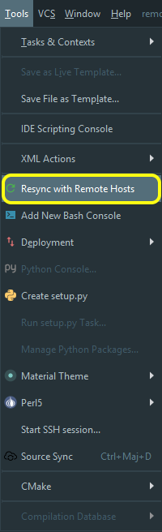

# Full remote mode with CLion

This document describes how to configure CLion in order to use the full remote mode.

The first step is to setup 2 virtual machines (that will be used as remote hosts).

# VM creation

We create 2 VM under VirtualBox (**6.1**) that will be used with CLion. The VM are:

* Ubuntu 18.04 bionic. Select the [minimal ISO](https://help.ubuntu.com/community/Installation/MinimalCD).
* Centos 8.0.1905. Select "[CD and DVD ISO Images](https://wiki.centos.org/Download)". The size of the ISO file does not exceed 600Mo.

The VM will be configured as described below:

* VM will be assigned static IPs.
* VM will be accessible from the host through SSH.
* VM will run an **FTP** server. This is required in order to allow project synchronization through the editor. The FTP server must have the [active mode](https://www.jscape.com/blog/bid/80512/active-v-s-passive-ftp-simplified) activated. We cannot use the port number 20 (_used for active mode_) for all VM, since it is only possible to configure one port redirection from the host.

Ubuntu version:

	dev@ubuntu:~$ lsb_release -a
	dev@ubuntu:~/projects/remote$ lsb_release -a
	LSB Version:    core-9.20170808ubuntu1-noarch:printing-9.20170808ubuntu1-noarch:security-9.20170808ubuntu1-noarch
	Distributor ID: Ubuntu
	Description:    Ubuntu 18.04.3 LTS
	Release:        18.04
	Codename:       bionic

CentOS version:

	[denis@localhost ~]$ cat /etc/centos-release
	CentOS Linux release 8.0.1905 (Core)

Detailed configuration:

Connexion from the host to the remote guest:

| VM       | SSH                       | FTP Command channel       | FTP data channels   |
|----------|---------------------------|---------------------------|---------------------|
| Ubuntu   | localhost:22  -> guest:22 | localhost:21  -> guest:21 | 6000,6001,6002,6003 |
| CentOS 8 | localhost:122 -> guest:22 | localhost:121 -> guest:21 | 6100,6101,6102,6103 |
| CentOS 6 | localhost:222 -> guest:22 | localhost:221 -> guest:21 | 7100,7101,7102,7103 |

# WARNING

When you start creating the VM from an ISO image, make sure that the USB is configured as follows: `UBS 1.1 (OHCI)`.

There is a bug with the default USB configuration (2.0). This bug makes all installations impossible.

# Ubuntu configuration

## SFTP server configuration

Installation:

	apt-get install vsftpd

We use the FTP server `vsftpd`.

The configuration file `/etc/vsftpd.conf` must be:

	listen=YES
	anonymous_enable=NO
	local_enable=YES
	write_enable=YES
	dirmessage_enable=YES
	use_localtime=YES
	xferlog_enable=YES
	connect_from_port_20=YES
	secure_chroot_dir=/var/run/vsftpd/empty
	pam_service_name=vsftpd
	rsa_cert_file=/etc/ssl/certs/ssl-cert-snakeoil.pem
	rsa_private_key_file=/etc/ssl/private/ssl-cert-snakeoil.key
	ssl_enable=NO

	pasv_enable=YES
	pasv_promiscuous=NO
	port_promiscuous=NO
	pasv_min_port=6001
	pasv_max_port=6003
	pasv_address=127.0.0.1

The important points are:
* `listen=YES`: this is important, otherwise, the configuration for the passive mode may not be loaded properly.
* `write_enable=YES`: you need to be able to upload files from the host to the VM (thus, to write files).
* `ssl_enable=NO`: we don't need to secure file transfers between PyCharm and the VM.
* `pasv_min_port=6001` and `pasv_max_port=6003`: because we will have to set NAT rules, we need to limit the number of possible ports to a reasonable amount.
* `pasv_address=127.0.0.1`: this parameter is very important. We will redirect all TCP connections to `127.0.0.1` (from the host) to the **private** IP address of the VM (`10.0.2.15` or `10.0.2.16`). Thus we want the FTP server to tell the FTP client to connect to `127.0.0.1`. If we don't set `pasv_address` to `127.0.0.1`, then the FTP server asks the FTP client to connect to its own private IP adresse (`10.0.2.15` or `10.0.2.15`)... however, this IP adresse is not accessible from the host!

> Please make sure that `pasv_min_port < pasv_max_port`!

Please note that, after you modify the configuration of the FTP server, you must reload it.

On Ubuntu 18.04 bionic:

	service vsftpd reload

## Network configuration

### Getting information about the network

Find the gateway:

	dev@ubuntu:~$ route -n
	Table de routage IP du noyau
	Destination     Passerelle      Genmask         Indic Metric Ref    Use Iface
	0.0.0.0         10.0.2.2        0.0.0.0         UG    100    0        0 enp0s3
	10.0.2.0        0.0.0.0         255.255.255.0   U     0      0        0 enp0s3
	10.0.2.2        0.0.0.0         255.255.255.255 UH    100    0        0 enp0s3

Gateway is `10.0.2.2`.

Find the DNS:

	dev@ubuntu:~$ systemd-resolve --statussystemd-resolve --status
	...
         DNS Servers: 10.0.24.10
                      10.0.24.11
                      194.2.0.20
                      194.2.0.50
                      193.238.148.11
                      8.8.8.8

DNS servers are `10.0.24.10`and `10.0.24.11`.

Find your IP and your netmask:

	dev@ubuntu:~$ ifconfig -a
	enp0s3: flags=4163<UP,BROADCAST,RUNNING,MULTICAST>  mtu 1500
	        inet 10.0.2.15  netmask 255.255.255.0  broadcast 10.0.2.255
	        inet6 fe80::a00:27ff:fe9a:6386  prefixlen 64  scopeid 0x20<link>
	        ether 08:00:27:9a:63:86  txqueuelen 1000  (Ethernet)
	        RX packets 2724  bytes 758220 (758.2 KB)
	        RX errors 0  dropped 0  overruns 0  frame 0
	        TX packets 1711  bytes 266586 (266.5 KB)
	        TX errors 0  dropped 0 overruns 0  carrier 0  collisions 0

You have:

* **IP**: `10.0.2.15`
* **netmask**: `255.255.255.0 => /24` (see [this link](https://www.computerhope.com/jargon/n/netmask.htm)).

### Configure the guest in order to have a static IP

Then edit the file `/etc/netplan/01-netcfg.yaml`, and set:

	network:
	  version: 2
	  renderer: networkd
	  ethernets:
	    enp0s3:
	     dhcp4: no
	     addresses: [10.75.3.71/23]
	     gateway4: 10.75.2.222
	     nameservers:
	       addresses: [10.0.24.10,10.0.24.11]

Then, apply the configuration:

	sudo netplan --debug apply

> See [this link](https://linuxconfig.org/how-to-configure-static-ip-address-on-ubuntu-18-10-cosmic-cuttlefish-linux).

> Once this is done, you can reboot the guest. The Guest IP address will be the one you've set.

# CentOS 8 configuration

## SFTP server configuration

Installation:

	yum install vsftpd

Edit the file `/etc/vsftpd/vsftpd.conf`. The configuration is identical to the one for the Ubuntu guest, except for the following lines:

	pasv_min_port=6101
	pasv_max_port=6103
	secure_chroot_dir=/usr/share/empty

> On CentOS the value of the parameter `secure_chroot_dir` is not identical to the one on Ubuntu.

Once the configuration file is set, restart the server:

	systemctl enable vsftpd
	systemctl start vsftpd
	systemctl status vsftpd

### Configure the guest in order to have a static IP

Edit `/etc/sysconfig/network-scripts/ifcfg-enp0s3`.

Set the following configuration:

	DEVICE=enp0s3
	ONBOOT=yes
	IPADDR=10.0.2.16
	NETMASK=255.255.255.0
	GATEWAY=10.0.2.2

Then configure the DNS server. Edit the file: `/etc/resolv.conf`. Set the configuration below:

	nameserver 10.0.24.10
	nameserver 10.0.24.11

And then restart the interface:

	ifdown enp0s3 && ifup enp0s3

> Once this is done, you can reboot the guest. The Guest IP address will be the one you've set.

# CentOS 6 configuration

## Prerequisites

You must make sure that:

* SELinux is disabled
* The firewall is disabled

### Disabling SELinux

Check the status of SELinux:

	[root@localhost vsftpd]# sestatus
	SELinux status:                 enabled
	SELinuxfs mount:                /selinux
	Current mode:                   enforcing
	Mode from config file:          enforcing
	Policy version:                 24
	Policy from config file:        targeted

To disable SELinux:

Edit `/etc/selinux/config`, and set `SELINUX` to `disabled`:

	# This file controls the state of SELinux on the system.
	# SELINUX= can take one of these three values:
	#     enforcing - SELinux security policy is enforced.
	#     permissive - SELinux prints warnings instead of enforcing.
	#     disabled - No SELinux policy is loaded.
	SELINUX=disabled
	# SELINUXTYPE= can take one of these two values:
	#     targeted - Targeted processes are protected,
	#     mls - Multi Level Security protection.
	SELINUXTYPE=targeted

Then reboot: `shutdown -r now`.

### Disabling the firewall

To disable the firewall:

	service iptables save
	service iptables stop
	chkconfig iptables off
	service ip6tables save
	service ip6tables stop
	chkconfig ip6tables off

## SFTP server configuration

The configuration file is identical to the one for the Unbuntu guest, except for these values:

	pasv_min_port=7100
	pasv_max_port=7103

Restart VSFTPD:

	sudo service vsftpd restart

Configure VSFTPD so it will start at boot time:

	chkconfig vsftpd on

### Configure the guest in order to have a static IP

Edit the file `/etc/sysconfig/network-scripts/ifcfg-eth0`.

Set the following content:

	DEVICE=eth0
	HWADDR=08:00:27:B3:14:72
	TYPE=Ethernet
	UUID=d7c5ed3f-c3b8-4539-aced-9ae3fd83502e
	ONBOOT=yes
	IPADDR=10.0.2.17
	PREFIX=24
	GATEWAY=10.0.2.2
	NM_CONTROLLED=yes
	BOOTPROTO=none

Then configure the DNS server. Edit the file: `/etc/resolv.conf`. Set the configuration below:

	nameserver 10.0.24.10
	nameserver 10.0.24.11

Then reaload the configuration:

	service network restart

# VirtualBox configuration

Among all the available [network modes](https://chrtophe.developpez.com/tutoriels/gestion-reseau-machine-virtuelle/), we select "NAT".

`Network` => `Adapter 1`

**Network access**: NAT

## Network redirections

**Ubuntu VM**: 

| Protocole | Host IP   | Host Port | Guest IP  | Guest Port | Service |
|-----------|-----------|-----------|-----------|------------|---------|
| TCP       | 127.0.0.1 | 21        | 10.0.2.15 | 21         | FTP     |
| TCP       | 127.0.0.1 | 22        | 10.0.2.15 | 22         | SSH     |
| TCP       | 127.0.0.1 | 6000      | 10.0.2.15 | 6000       | FTP     |
| TCP       | 127.0.0.1 | 6001      | 10.0.2.15 | 6001       | FTP     |
| TCP       | 127.0.0.1 | 6002      | 10.0.2.15 | 6002       | FTP     |
| TCP       | 127.0.0.1 | 6003      | 10.0.2.15 | 6003       | FTP     |

**Centos 8 VM**: 

| Protocole | Host IP   | Host Port | Guest IP  | Guest Port | Service |
|-----------|-----------|-----------|-----------|------------|---------|
| TCP       | 127.0.0.1 | 121       | 10.0.2.16 | 21         | FTP     |
| TCP       | 127.0.0.1 | 122       | 10.0.2.16 | 22         | SSH     |
| TCP       | 127.0.0.1 | 6100      | 10.0.2.16 | 6100       | FTP     |
| TCP       | 127.0.0.1 | 6101      | 10.0.2.16 | 6101       | FTP     |
| TCP       | 127.0.0.1 | 6102      | 10.0.2.16 | 6102       | FTP     |
| TCP       | 127.0.0.1 | 6103      | 10.0.2.16 | 6103       | FTP     |

**Centos 6 VM**: 

| Protocole | Host IP   | Host Port | Guest IP  | Guest Port | Service |
|-----------|-----------|-----------|-----------|------------|---------|
| TCP       | 127.0.0.1 | 221       | 10.0.2.16 | 21         | FTP     |
| TCP       | 127.0.0.1 | 222       | 10.0.2.16 | 22         | SSH     |
| TCP       | 127.0.0.1 | 7100      | 10.0.2.16 | 7100       | FTP     |
| TCP       | 127.0.0.1 | 7101      | 10.0.2.16 | 7101       | FTP     |
| TCP       | 127.0.0.1 | 7102      | 10.0.2.16 | 7102       | FTP     |
| TCP       | 127.0.0.1 | 7103      | 10.0.2.16 | 7103       | FTP     |

> On the Unbuntu VM, the ports from 6000 to 6003 are reserved from the _FTP passive mode_.
> On the CentOS 8 VM, the ports from 6100 to 6103 are reserved from the _FTP passive mode_.
> On the CentOS 6 VM, the ports from 7100 to 7103 are reserved from the _FTP passive mode_.

# Prepare the VM

We need to install CMake on the VM.

CentOS:

	yum install cmake

Ubuntu:

	apt-get install cmake

# Clion configuration

Please see [this link](https://www.jetbrains.com/help/clion/remote-projects-support.html).
The text below gives more details on the configuration.

## Deployments

**NOTE**: you don't need to create deployment configurations manually - CLion creates a deployment configuration automatically when a "Remote Host" toolchain is created (see [this link](https://intellij-support.jetbrains.com/hc/en-us/community/posts/360006992440-Configure-CLion-so-it-doesn-t-modify-CMakeLists-txt)). 

`Tools` -> `Deployments` -> `Configuration...`

Click on `Add`, and then follow the instructions. Make sure to choose **FTP**.

For the Ubuntu VM, the configuration is:

* host: 127.0.0.1
* port: 21

For the CentOS VM, the configuration is:

* host: 127.0.0.1
* port: 121

In the tab `Mappings`, make sure to set the value for the parameter `Deployment path`.

> To deploy a single file, a directory or the whole project: `[Ctrl]`+`[Maj]`+`[Alt]`+`[x]`.

## SSH terminal

`Tools` -> `Start SSH session...`

For the Ubuntu VM, the configuration is:

* host: 127.0.0.1
* port: 22

For the CentOS VM, the configuration is:

* host: 127.0.0.1
* port: 122

## Build tool chain

`File` => `Settings` => `Build, Execution, Deployment` => `Toolchains`.

Add a "Remote host".

Ubuntu:

Centos:

**WARNING**

When configuring the connection for the toolchain, make sure to check the checkbox "Save Password".

> If you forget to check the checkbox, then the configuration will be lost after an editor restart.
> You may lose time asking yourself what causes build problems.

## Configuration for auto-completion and code analysis

CLion uses the CMake configuration in order to find the paths to the header files used to compile on the remote host. It looks for the CMake property [INCLUDE_DIRECTORIES](https://cmake.org/cmake/help/v3.10/prop_tgt/INCLUDE_DIRECTORIES.html?highlight=include_directories).

Example:

	set(EXTERNAL_HEADERS_PATH /home/dev/resources/include)
	set_property(
	        TARGET remote
	        APPEND PROPERTY
	        INCLUDE_DIRECTORIES "${EXTERNAL_HEADERS_PATH}"
	)

**Very important note**: every time you switch the compiler or make changes in your project dependencies, make sure to update header search paths manually by calling **Tools | Resync with Remote Hosts** ([see this documentation](https://www.jetbrains.com/help/clion/remote-projects-support.html#resync)).

## CMakeLists.txt management

### Add to target... or not

You may notice that CLion updates the file "CMakeLists.txt" upon various events.
For example, when you create a new source file, then CLion may add this file to "CMakeLists.txt".
This behaviour may be suitable for simple projects. However, for complex ones (with many executables), you probably need to deactivate this feature.

To do that, you just need to uncheck "Add to target" when you create a new file (see [this link](https://intellij-support.jetbrains.com/hc/en-us/community/posts/360006992440-Configure-CLion-so-it-doesn-t-modify-CMakeLists-txt)).

### You should specify sources dependencies using relative paths

It is valid practice to specify absolute paths to sources by using the CMake variable `CMAKE_BINARY_DIR`. For example:

	set(LOCAL_SRC_DIRECTORY "${CMAKE_BINARY_DIR}/src")
	add_library(SL_Lib
	        "${LOCAL_SRC_DIRECTORY}/SL_Status.c"
	        "${LOCAL_SRC_DIRECTORY}/SL_Status.h"
	)

However, this configuration may cause trouble when CLion tries to resync with the remote host.

You should specify relatve paths:

	add_library(SL_Lib
	        src/SL_Status.c
	        src/SL_Status.h
	)

## Good links

[CLion answers frequently asked questions](https://blog.jetbrains.com/clion/2014/09/clion-answers-frequently-asked-questions/)

[How to properly add include directories with CMake](https://stackoverflow.com/questions/13703647/how-to-properly-add-include-directories-with-cmake)

